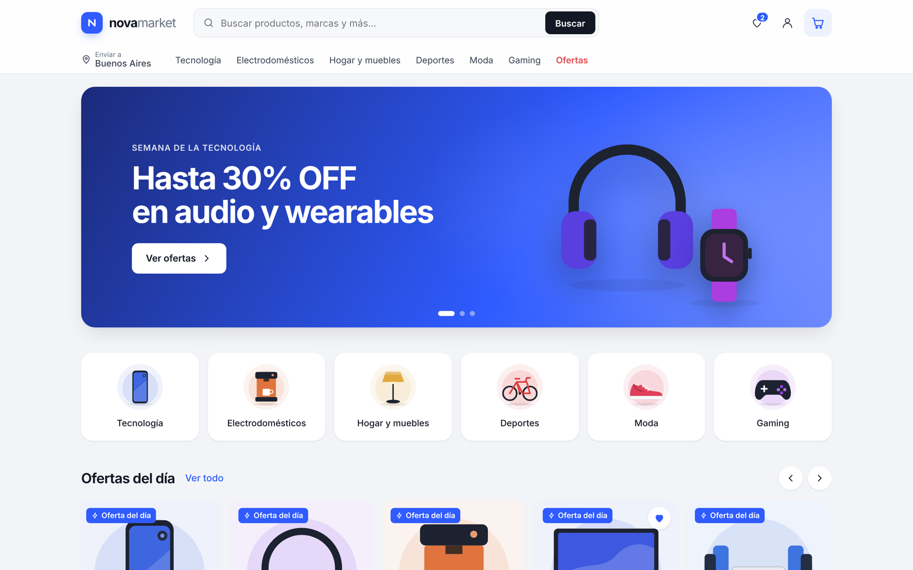
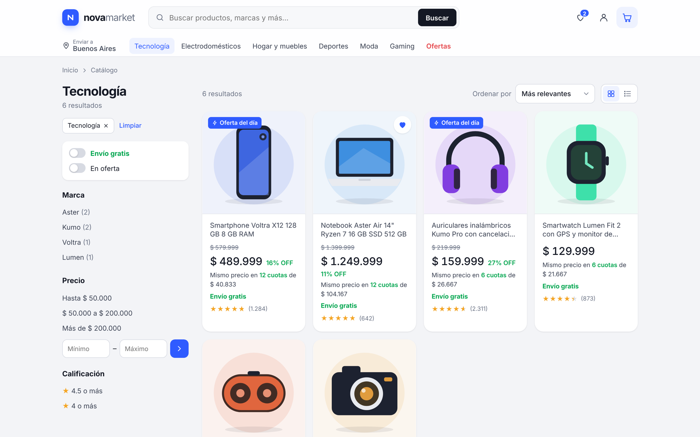
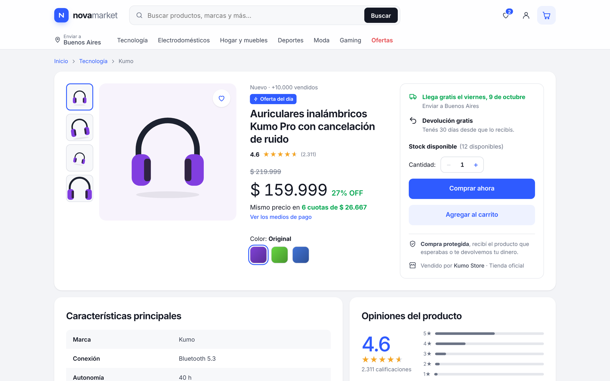
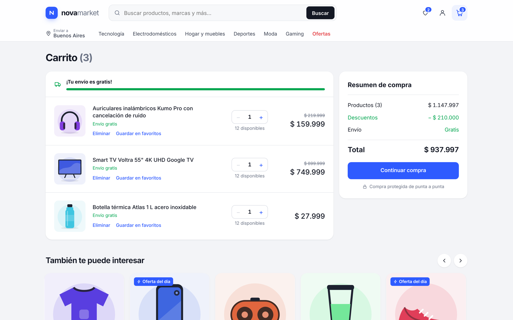
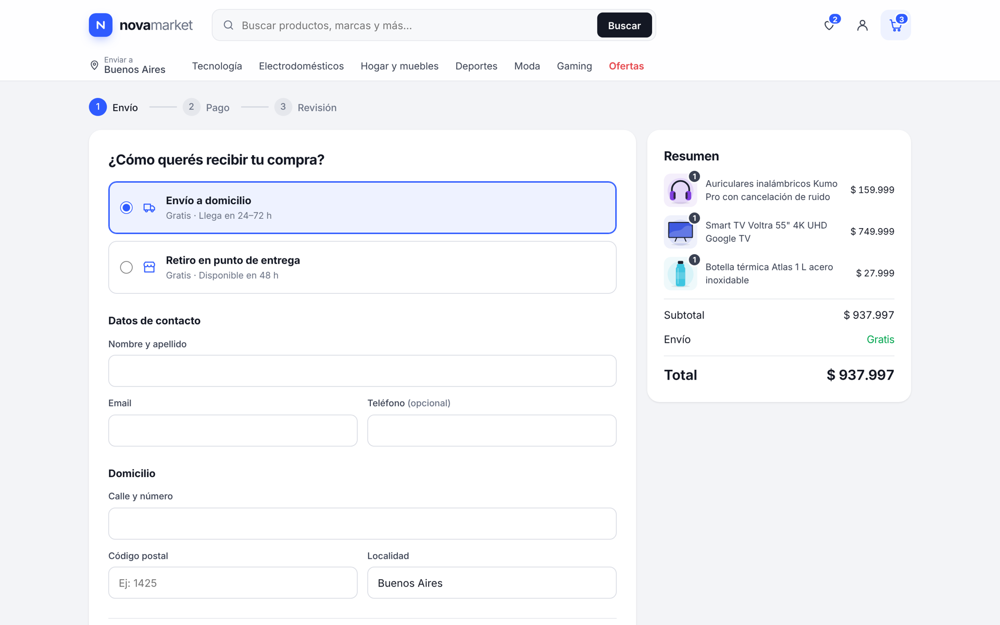
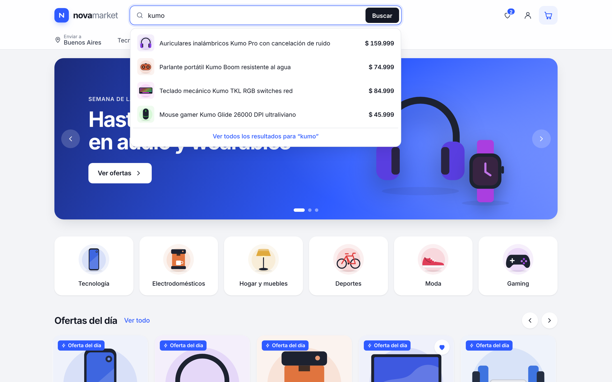

<div align="center">

# nova market

**Template de e-commerce tipo marketplace — minimalista, rápido y responsive.**

Vue 3 · Vue Router · Pinia · Vite

[**Ver demo**](https://cheloxnz.github.io/nova-market/) · [Portfolio](https://cheloxnz.github.io/)



</div>

## ✨ Funcionalidades

- **Home** con banner rotativo, accesos por categoría, ofertas del día, más vendidos y recomendados.
- **Búsqueda con autocompletado** (navegable con teclado) y página de resultados.
- **Filtros combinables** sincronizados con la URL: categoría, marca, rango de precio, calificación, envío gratis y ofertas.
- **Orden** por relevancia, precio, más vendidos y mejor calificados · vista **grilla / lista** · **paginación**.
- **Ficha de producto**: galería con zoom al pasar el mouse, variantes de color, cuotas, fecha estimada de entrega, stock, características, opiniones y preguntas.
- **Carrito** con cantidades, ahorro, barra de progreso hacia el envío gratis y sugerencias.
- **Checkout en 3 pasos** (envío → pago → revisión) con validación de formularios y confirmación de pedido.
- **Favoritos** y **carrito** persistidos en `localStorage`.
- Ilustraciones de producto **100% SVG** (nítidas en cualquier resolución, sin dependencias de imágenes externas).
- Diseño **responsive** (mobile-first en navegación, drawer de filtros y de menú) y accesible (foco visible, `aria-*`, `prefers-reduced-motion`).

> ⚠️ Proyecto demo: productos y marcas son ficticios y el pago es simulado — no se piden ni procesan datos de tarjetas.

## 📸 Capturas

| Resultados y filtros | Ficha de producto |
| --- | --- |
|  |  |
| **Carrito** | **Checkout** |
|  |  |
| **Autocompletado** | **Compra confirmada** |
|  |  |

**Mobile**


## 🧱 Stack y estructura

```
src/
├── components/   # Header, ProductCard, ProductArt (SVG), ProductRow, Toast, Stars…
├── views/        # Home, Search, Product, Cart, Checkout, Favorites, 404
├── stores/       # Pinia: carrito, favoritos, toasts (persistido)
├── data/         # Catálogo de ejemplo y helpers (precio, descuento)
├── router.js     # Vue Router (hash history para GitHub Pages)
└── styles.css    # Design tokens y utilidades
```

## 🚀 Correr localmente

```bash
npm install
npm run dev      # http://localhost:5173/nova-market/
npm run build
```

## 🌐 Deploy

Cada push a `main` publica automáticamente en GitHub Pages mediante `.github/workflows/deploy.yml`
(**Settings → Pages → Source: GitHub Actions**).

Para usar el catálogo propio, editá `src/data/products.js` o reemplazalo por una llamada a tu API.

---

Hecho por [Marcelo Del Valle](https://cheloxnz.github.io/) · [LinkedIn](https://www.linkedin.com/in/chelodelvalle/)
